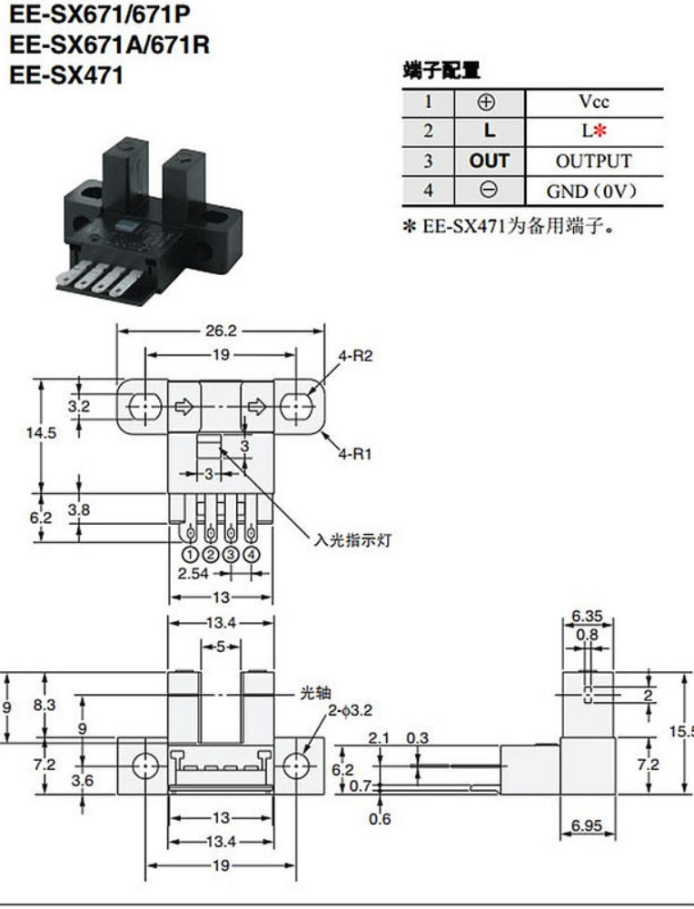

# 戴板配置与接线

## 0 重要事项

### 0.1 戴板的CAN接口的排列顺序与常规不同，为【低】【高】【地】

常见为【高】【低】【地】，【高】【地】【低】，
我们所使用的CAN分析仪的接口为【高】【地】【低】，
因此戴板做CAN线接头时要仔细检查确认。

### 0.2 固件编译时需要根据板子的类型确定ID号

## 1 接线

电源线 24v

[CAN 分析仪接线](CAN.md)

[中菱伺服控制器接线](CAN.md)

特别要注意我们所使用的CAN分析仪接口为【高】【地】【低】，接入RJ45时要按【高】【低】【地】接入。

### 1.1 戴板接CAN转接板

由于戴板用于驱动电磁阀，因此其CAN必须接到CAN2上。戴板的CAN接口顺序有些与众不同【L】【H】【GND】，因此
做线时要多加小心接线顺序。

#### 核心板电源及光电开关连接

### 1.4 戴板FT输入接口

#### 1.4.1 目前用于光电开关的输入接口

目前所使用的671A均采用下拉配置、上升沿触发，将来考虑将一部分采用671.

为接线方便当前使用的GPIO口全部位于J8，见下图桔色框部分

其中编号尾数0-4的5个接口单独外部中断，5-9的5个共用一个中断。为防止中断冲突后5个不要同时进行伺服电机初始化。

戴板上没有5v电源，因此电源从核心板飞线拾取。（**将来新的扩展板考虑优化布线即提供5v电源**）

为逻辑上的方便当前我们采用分对初始化，每次从0-4中选择一个再从5-9中选择一个同时初始化，完成后依次选下一对。

为了检测异常，未来考虑将限位的光电管也接入单片机，当伺服电机跑飞后通过心跳包将异常传递给控制中心。相关的数据结构位于
protocol.h 中，控制中心与单片机的版本保持一致。单片机使用C语言，控制中心使用C++20，protocol.h采用条件编译
的方式同时提供给单片机和控制中心使用。

#### 1.4.2 预留接口

### 1.5 多板拼接方法

## 2 固件编译的配置

