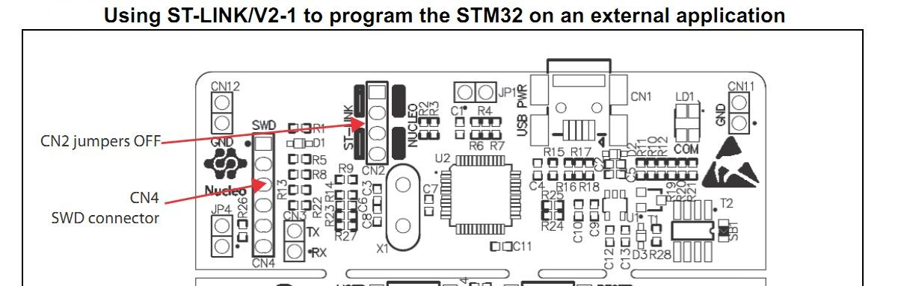
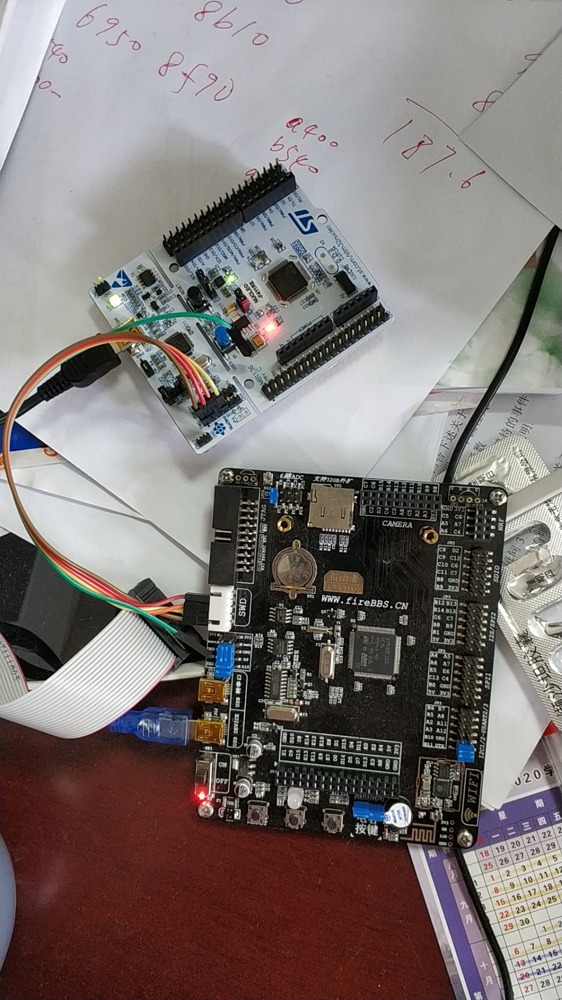

# ST-LINK/V2-1 板载仿真器

板载仿真器经过设置可用于调试外部STM32系列电路板。

## ST-LINK/V2-1引脚定义及跳线

**ST-LINK/V2-1 只能调试 STM32 系列芯片**
       
| foot | CN4 | description |
| :---: | --- | --- |
| 1 | VDD_TARGET | target VDD |
| **2** | **SWCLK SWD** | clock |
| 3 | GND | ground |
| **4** | **SWDIO SWD** | data I/O |
| 5 | NRST | target MCU RESET |
| 6 | SWO | reserved |

**调试外接电路板时需要将 CN2 两个跳线悬空**

## ST-LINK/V2-1 连接 STM32F103

**如果不接1、3脚，会对目标MCU板的电源造成很剧烈的干扰。**

