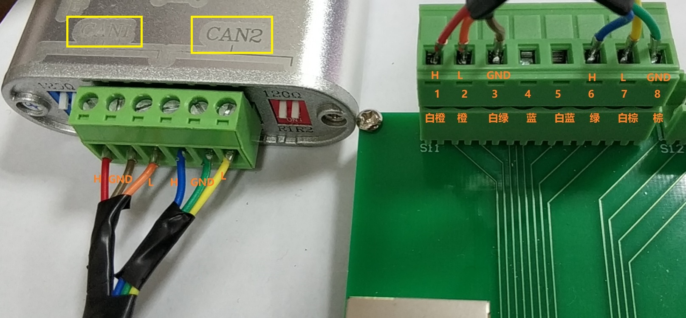
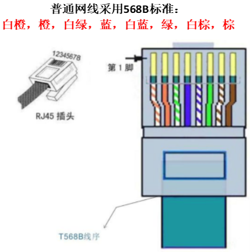
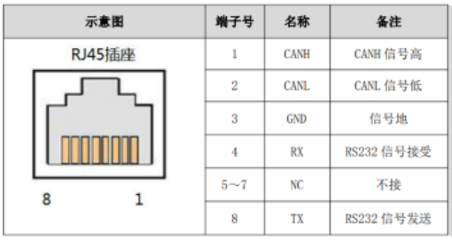
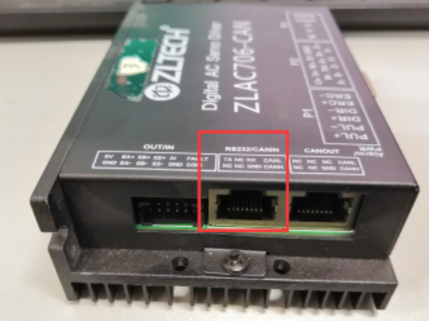
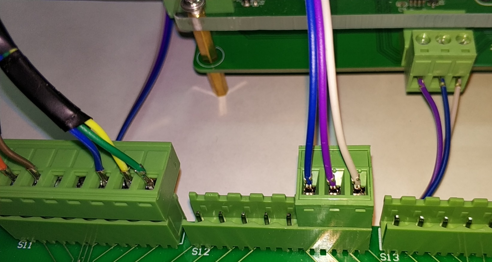
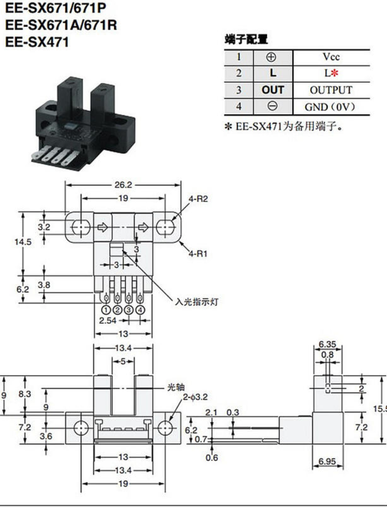
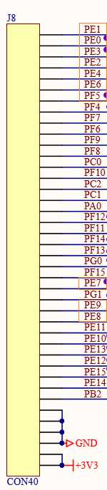

# 戴保定板配置与接线

## 0 重要事项

### 0.1 戴板的CAN接口的排列顺序与常规不同，为【低】【高】【地】

常见为【高】【低】【地】，【高】【地】【低】，
我们所使用的CAN分析仪的接口为【高】【地】【低】，
因此戴板做CAN线接头时要仔细检查确认。

### 0.2 固件编译时需要根据板子的类型确定ID号

## 1 接线

电源线 24v

CAN线

### 1.1 CAN 分析仪接线图

上图左边是CAN分析仪，右边是CAN转接RJ45的接头(其中标注了引脚号和568B标准接线颜色)

**注意：由于中菱伺服控制器串口占据了4口及8口，尽管中间5-7口未用，但测试发现如果将5-7口用于CAN通信将与伺服控制器
发生冲突，导致伺服控制器工作异常并导致控制电路板死机。**

将来设计新的转接板时考虑接伺服控制器的RJ45口的4-8口悬空，而接控制电路板的RJ45口的1-5口悬空。

CANanalyst-II有两组CAN，CAN1被用于伺服电机控制（接伺服控制器），CAN2被用于电磁阀控制（接控制电路板）。

### 1.2 中菱伺服控制器接线图

CAN线的接线顺序与中菱伺服电机的保持兼容

中菱伺服电机控制器CAN口接线图

其CAN接入口位于控制器左侧中央，RJ45接口（图中红色框内所标注的接口）：

综上所述，中菱伺服电机控制器的CAN接线是CANH（1脚，白橙）、CANL（2脚，橙）、GND（3脚，白绿）。

我们将CAN分析仪的两路CAN分别接入到普通网线，规则是：
CHANNEL 0 通道的CANH、CANL、GND分别接到1脚（白橙）、2脚（橙）、3脚（白绿）。
CHANNEL 1 通道的CANH、CANL、GND分别接到6脚（绿）、7脚（白棕）、8脚（棕）。

特别要注意我们所使用的CAN分析仪接口为【高】【地】【低】，接入RJ45时要按【高】【低】【地】接入。

### 1.3 戴板接CAN转接板

由于戴板用于驱动电磁阀，因此其CAN必须接到CAN2上。戴板的CAN接口顺序有些与众不同【L】【H】【GND】，因此
做线时要多加小心接线顺序。

#### 核心板电源及光电开关连接

### 1.4 戴板FT输入接口

#### 1.4.1 目前用于光电开关的输入接口

目前所使用的671A均采用下拉配置、上升沿触发，将来考虑将一部分采用671.

为接线方便当前使用的GPIO口全部位于J8，见下图桔色框部分

其中编号尾数0-4的5个接口单独外部中断，5-9的5个共用一个中断。为防止中断冲突后5个不要同时进行伺服电机初始化。

戴板上没有5v电源，因此电源从核心板飞线拾取。（**将来新的扩展板考虑优化布线即提供5v电源**）

为逻辑上的方便当前我们采用分对初始化，每次从0-4中选择一个再从5-9中选择一个同时初始化，完成后依次选下一对。

为了检测异常，未来考虑将限位的光电管也接入单片机，当伺服电机跑飞后通过心跳包将异常传递给控制中心。相关的数据结构
位于 protocol.h 中，控制中心与单片机的版本保持一致。单片机使用C语言，控制中心使用C++20，protocol.h采用条件编译
的方式同时提供给单片机和控制中心使用。

#### 1.4.2 预留接口

### 1.5 多板拼接方法

## 2 固件编译的配置

